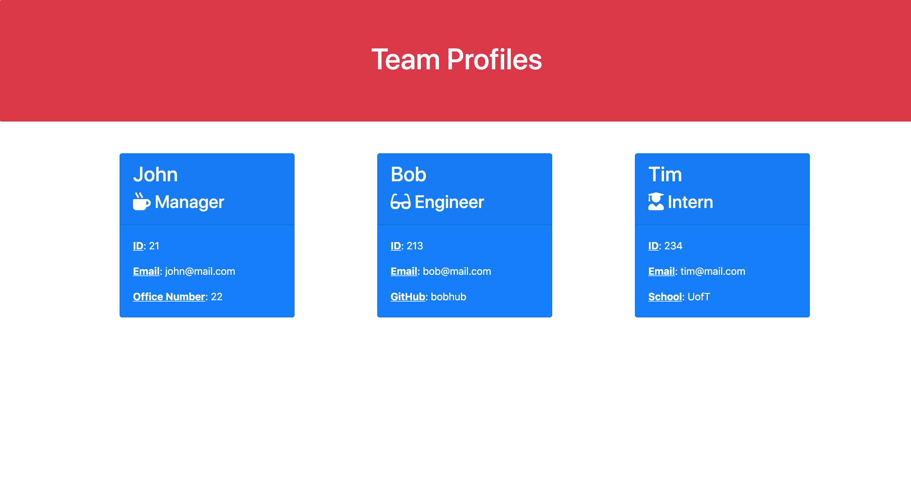

[](https://opensource.org/licenses/MIT)

  # Team Portfolio Generator

  ## Description

    A Node.js command-line application that takes in information about employees on a software engineering team and generates an HTML webpage that displays summaries for each person.

  Link to repo: https://github.com/johannt91/team-profile-generator

  ## Table of Contents

  * [Installation](#installation)
  * [Usage](#usage)
  * [License](#license)
  * [Contributing](#contributing)
  * [Test](#test)
  * [Questions](#questions)

  ### Installation
  
  ```
  npm i
  ```

  ### Usage

  Run: node index

  ### License
  This project is licensed under [MIT](https://opensource.org/licenses/MIT)

  ### Contributing
  
  N/A

  ### Tests
  
  ```
  npm run test
  ```

  ## Questions
  
  If you have any questions about the repo, please contact me at j.taylor1343@gmail.com.

  You can find more of my work and projects at [johannt91](https://github.com/johannt91).

